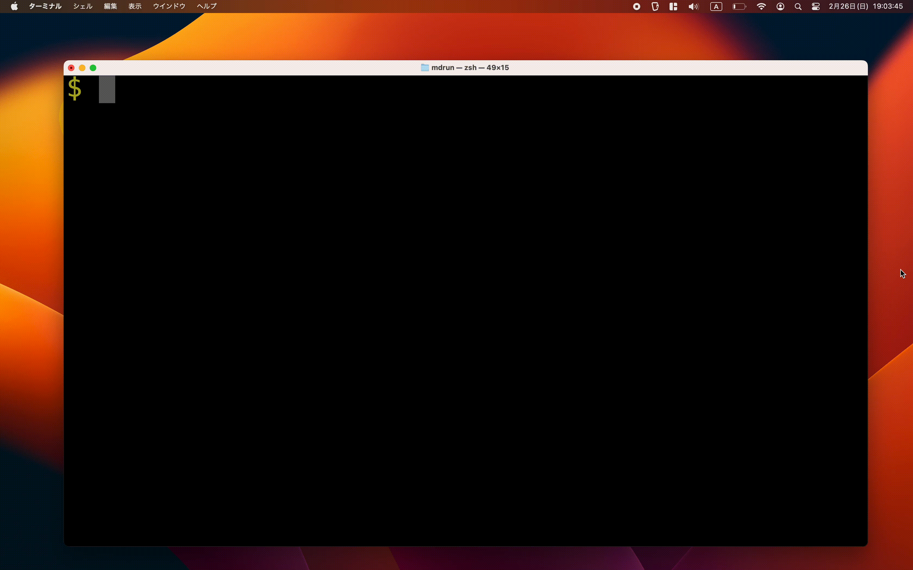

# mdrun: Task runner for commands defined in markdown

mdrun is a task runner that uses an ambiguous search to select and execute commands defined in code blocks in markdown files such as README.md.



## Setup

```
$ go install github.com/yammerjp/mdrun
```

## Run

### List Commands

```
$ mdrun list
```

### Show a Command

```
$ mdrun --dry-run
```

### Run a Command

```
$ mdrun
```

### Help

```
$ mdrun --help
```

### Specify Task Defined Markdown File

```
$ mdrun --target path/to/markdownfile.md
```

## Development

### test

```
$ go test ./...
```
